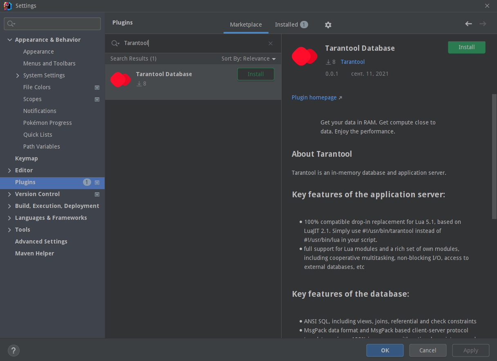
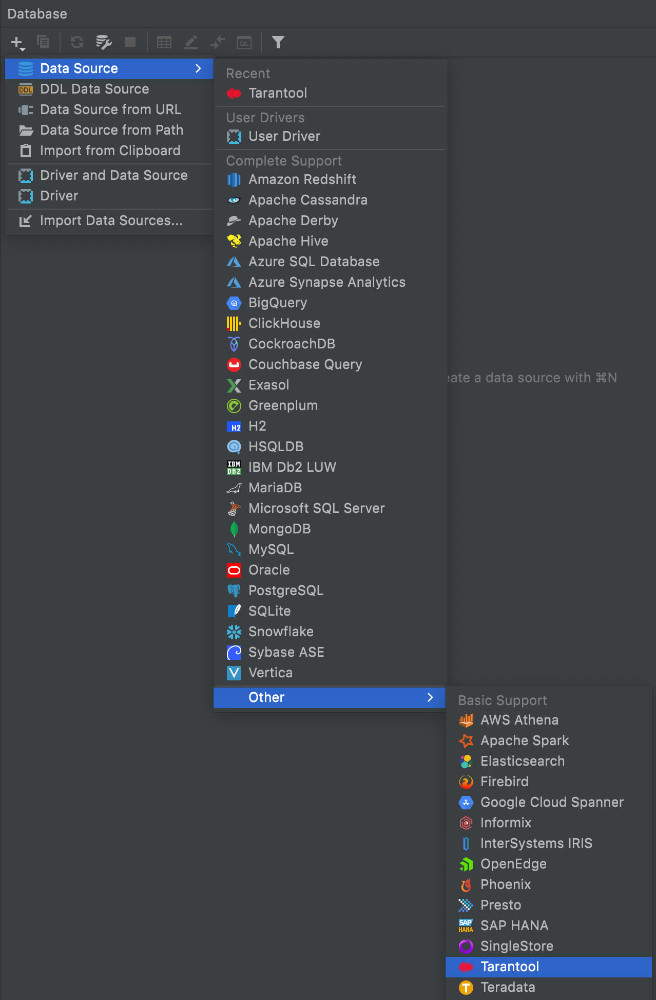
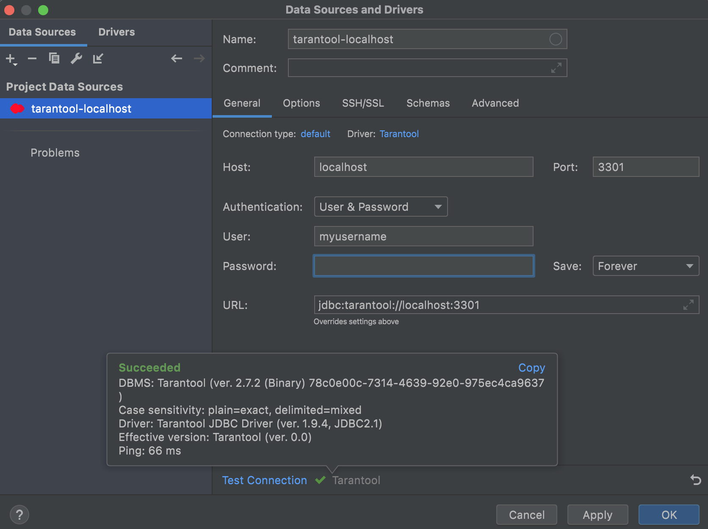
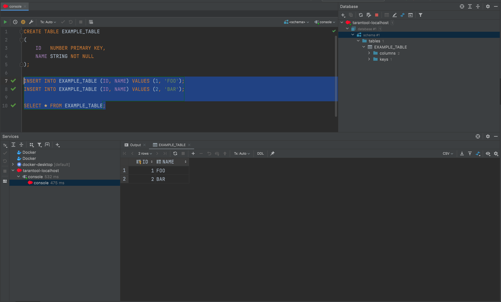
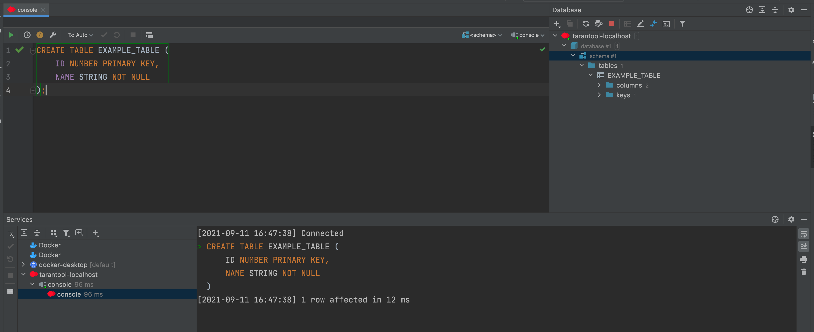

[![Contributions welcome][contributions-welcome-svg]][plugin-repo]
[![Downloads][plugin-downloads-svg]][plugin-repo]
[![Rating][plugin-rating-svg]][plugin-repo]
[![Version][plugin-version-svg]][plugin-repo]
 
# Tarantool Plugin for IntelliJ

Plugin that implements Tarantool support in IntelliJ Platform-based IDEs.

##### Contact maintainers:
* [Github issues](https://github.com/tarantool/tarantool-idea-plugin/issues)

##### Resources:

* [Plugin homepage](https://plugins.jetbrains.com/plugin/17422-tarantool-database)
* [Changelog](CHANGELOG.md)

#### Compatibility

---
**NOTE**

Plugin relies on DataGrip plugin functionality, which only present in Ultimate editions of IDEs, it cannot be used with Community Edition IDEs.

---

IntelliJ IDEA, PyCharm, CLion, PhpStorm, WebStorm, RubyMine, AppCode, DataGrip, GoLand, Rider, Cursive,
Android Studio and other IntelliJ platform based IDEs which support *DataGrip*.
Actual information can always be found on plugin home page.

Setup
------------

Tarantool Plugin can be installed via `Settings | Plugins`.
  See the [detailed instructions](https://www.jetbrains.com/help/idea/managing-plugins.html#)

After installation and *restart* of IDE new DB entry should be available:

You can configure your new connection via dialog window:

Summary of Supported Tarantool Features
---------------------------------

Plugin based on [Datagrip](https://www.jetbrains.com/datagrip/) functionality, so it supports almost all Datagrip features 
such as data navigation, exploring, making queries, sorting and paginating output. 

For more information about DataGrip - browse [official documentation](https://www.jetbrains.com/datagrip/features/).

Authors
-------

See [AUTHORS](AUTHORS)
for a list of authors and contributors.

License
-------

See [LICENSE](LICENSE) for a list of redistribution, modication and usage rules.

<!-- Badges -->
[plugin-repo]: https://plugins.jetbrains.com/plugin/17422-tarantool-database
[plugin-downloads-svg]: http://img.shields.io/jetbrains/plugin/d/17422
[plugin-rating-svg]: https://img.shields.io/jetbrains/plugin/r/rating/17422
[plugin-version-svg]: https://img.shields.io/jetbrains/plugin/v/17422
[contributions-welcome-svg]: http://img.shields.io/badge/contributions-welcome-brightgreen